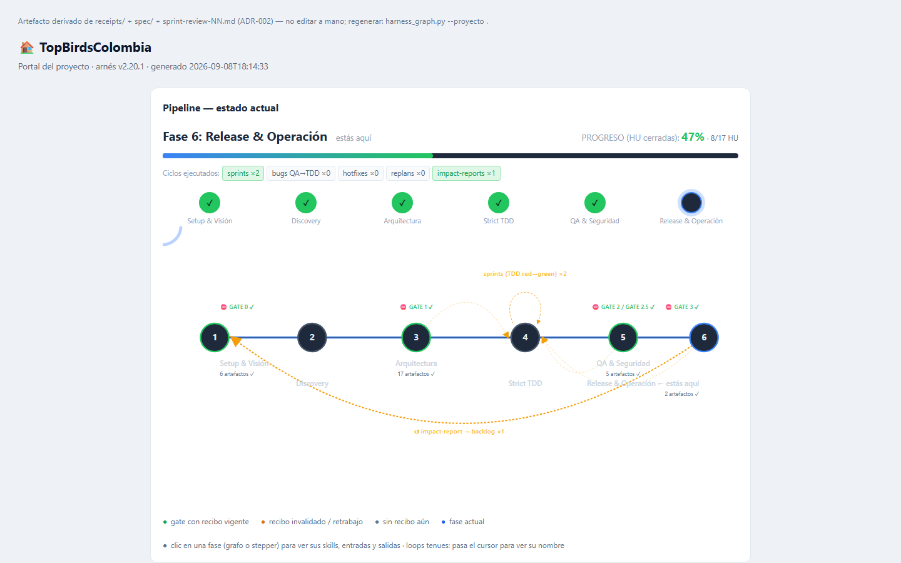
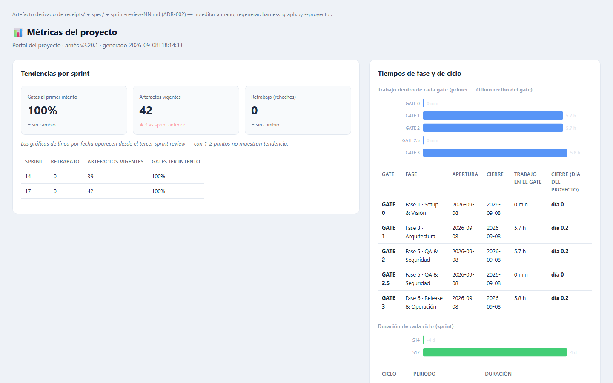
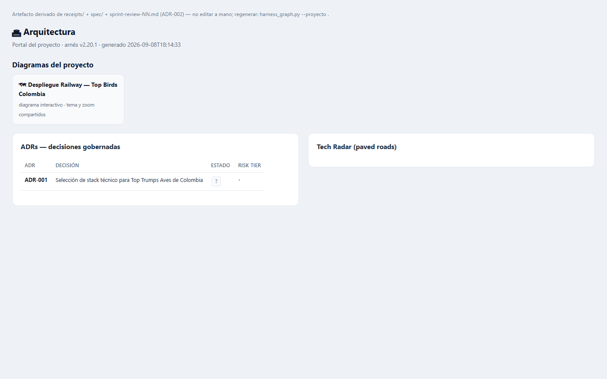

# Top Trumps Aves de Colombia

Aplicación demo de cartas estilo Top Trumps con aves de Colombia. Construida para demostrar un arnés de desarrollo de software completo (SDD + TDD + RDD) en 15 sprints.

## Funcionalidades

- **Selección de baraja al iniciar partida (HU-09)**: el jugador elige entre una baraja temática aleatoria (por defecto, elegida server-side), la colección completa de 52 cartas o una expedición por región (Andina, Caribe, Pacífico, Amazonía, Orinoquía) con el conteo de aves en pantalla.
- **Baraja curada de 52 aves** generada desde `topbirds_dataset` (iNaturalist Open Data): siempre incluye las 13 especies amenazadas (UICN VU/EN/CR), prioriza las 146 especies con dimorfismo sexual y está balanceada por región; cada carta lleva atribución de fotógrafo y licencia.
- **Cartas enriquecidas con fotografía (HU-10, HU-12, HU-15)**: thumbnails webp (~200 px) servidos por el frontend con variantes por sexo; las especies dimórficas muestran badge y toggle macho/hembra, las amenazadas (UICN VU/EN/CR) llevan sello de conservación y las migratorias boreales un badge de visitante (temporada nov-feb).
- **Bono «¿Macho o hembra?» (HU-11, RN-10)**: una vez por partida, en tu turno, puedes apostar el sexo de la carta del oponente; acertar gana la ronda aunque pierdas el atributo.
- **Ronda de altitud (HU-14, RN-11)**: una vez por partida puedes jugar el atributo oculto `altitud_max_msnm` («¿Quién vive más alto?»).
- **Combo taxonómico (HU-16, RN-12)**: ganar dos rondas seguidas con aves del mismo orden suma +1 carta del oponente.
- **Resumen de expedición (HU-13)**: al terminar, la pantalla de resultado lista las aves que viste («Tu expedición por {región}» o «Tu recorrido por Colombia»).
- **Quiz «Modo Ornitólogo» (HU-17, RN-14)**: modo de práctica con fotos y 4 opciones de identificación (nombre común + científico), puntaje de 5 preguntas y crédito del fotógrafo.
- Modos de juego contra la IA o hot-seat (dos humanos, mismo dispositivo).
- API REST con validación de contrato (Schemathesis), rate limiting y headers de seguridad.
- Portal SDLC auto-generado que publica la spec, recibos SHA-256, métricas y memoria del proyecto (ver siguiente sección).

## Resultados del Sprint 17 (cierre del ciclo HU-10..HU-17)

- **Implementación completa con TDD** (orden test→feat verificado): 76 thumbnails webp con crédito de fotógrafo y licencia, `barajas.json` 1.1.0 enriquecido (variantes por sexo, UICN, orden, endemismo, estacionalidad, altitud), backend con RN-10/11/12 (bono «¿Macho o hembra?», ronda de altitud, combo taxonómico) y frontend con las 8 historias implementadas.
- **Suites verdes**: pytest 94.85 % de cobertura (backend), vitest 59/59 (frontend) y build OK.
- **Fase 8 cerrada**: sprint review 17 en `spec/reports/sprint-review-17.md` (43 recibos vigentes, gates al primer intento 100 %, 0 roles en freestyle), memorias archivadas sin conflictos ni candidatos pendientes, portal regenerado (45 páginas) con `--check` sin drift.
- **Pendiente para el Sprint 18**: RN-15 (empate con amenazada, requiere decisión del PO) y 7 cartas sin thumbnail por imágenes fuente ausentes (el frontend muestra placeholder).

## Stack

- **Backend:** Python 3.11 + FastAPI + Pydantic + SQLite
- **Frontend:** React 19 + TypeScript + Vite + TailwindCSS
- **Testing:** pytest (backend), Vitest + React Testing Library (frontend), Playwright (E2E), Schemathesis (contract)

## Estructura

```
spec/        # Artefactos del SDLC (visión, user-stories, ADRs, recibos, portal, etc.)
src/backend/ # API FastAPI
src/frontend/# React SPA
tests/e2e/   # Pruebas end-to-end con Playwright
topbirds_dataset/ # Dataset enriquecido (JSON versionado; imágenes crudas fuera del repo)
scripts/     # Utilidades (p. ej. build_baraja.py, genera la baraja del juego)
docs/        # Documentación adicional e imágenes del portal (docs/images/)
```

## Ejecución local

### Requisitos

- Python 3.11+ y un entorno virtual en `.venv`
- Node.js 22+ y npm

### Backend

```powershell
cd src/backend
..\..\.venv\Scripts\python.exe -m uvicorn app.main:app --reload --port 8000
```

### Frontend

En otra terminal:

```powershell
cd src/frontend
npm run dev
```

La aplicación estará en `http://localhost:5173`. El proxy de Vite redirige `/api` al backend (`http://localhost:8000`).

### Pruebas

Backend:

```powershell
cd src/backend
..\..\.venv\Scripts\python.exe -m pytest -q
```

Frontend:

```powershell
cd src/frontend
npm test
npm run test:coverage
npm run build
```

End-to-end:

```powershell
cd tests/e2e
npx playwright test
```

## El portal del proyecto (SDLC)

El arnés genera un portal estático en `spec/portal/` (entrada: `spec/portal/index.html`, también publicado vía `spec/dashboard.html`) que navega la spec completa: user stories con Gherkin, contrato OpenAPI, ADRs, backlog, métricas del harness y memoria de proyecto. Las imágenes de esta sección viven en `docs/images/` y se capturan automáticamente de las páginas del portal.

| Inicio | Métricas | Arquitectura |
|---|---|---|
|  |  |  |

**Mantenimiento de las imágenes**: cuando la spec cambie, regenera el portal y vuelve a capturar para mantener el README sincronizado:

```powershell
# 1. Regenerar portal + dashboard (valida drift vs recibos)
python .agents/skills/sdlc-orchestrator/scripts/harness_graph.py --proyecto .
python .agents/skills/sdlc-orchestrator/scripts/harness_graph.py --proyecto . --check

# 2. Re-capturar las imágenes (Playwright, usa los browsers ya instalados en tests/e2e)
cd tests/e2e
foreach ($p in @("inicio","metricas","arquitectura")) {
  npx playwright screenshot --viewport-size="1440,900" --wait-for-timeout=1500 `
    "..\..\spec\portal\paginas\$p.html" "..\..\docs\images\portal-$p.png"
}
```

## Pipeline CI/CD

[](https://github.com/csalamando/TopBirdsColombia/actions/workflows/ci.yml)

El workflow `.github/workflows/ci.yml` ejecuta en cada push/PR:

- Backend: `bandit`, `pytest` con cobertura ≥ 70 %, `pip-audit`.
- Frontend: `oxlint`, `eslint-plugin-security`, `npm test`, `npm run build`, `npm audit`.
- E2E: levanta backend + frontend y corre `npx cucumber-js`.
- DAST: levanta backend y ejecuta `schemathesis`.

## Docker local

```powershell
cd "D:\AI Projects\TopBirdsColombia"
docker build -f src/backend/Dockerfile -t topbirds:latest .
docker run -p 8000:8000 -e CORS_ORIGINS=http://localhost:8000 topbirds:latest
```

La aplicación estará en `http://localhost:8000`.

## Despliegue de demostración (Railway)

El backend se despliega en [Railway](https://railway.com). La infraestructura se gestiona como código en `.railway/railway.ts` (Railway IaC): servicio `TopBirdsColombia`, source GitHub, health check `/health` y variables de entorno. El build usa Docker con `src/backend/Dockerfile` (configuración del servicio; el DSL de IaC no expone `dockerfilePath`).

**Requisitos del CLI** (una vez por máquina):

```powershell
npm i -g @railway/cli
npm install   # instala el SDK `railway` (IaC) en la raíz del repo
railway login
```

**Workflow de IaC** (aplicar cambios de `.railway/railway.ts`):

```powershell
railway link -p <proyecto>
railway config plan     # previsualiza cambios
railway config apply    # aplica tras confirmar
```

> Nota Windows: por un bug del SDK (`railway/iac` no encuentra el ejecutable del CLI), exporta antes `$env:_ = "$env:APPDATA\npm\node_modules\@railway\cli\bin\railway.exe"`.

**Despliegue**: con el repo conectado, cada push a `main` dispara el build (Dockerfile). También manual: `railway up --detach -y`.

Variables del servicio (definidas en IaC): `PORT=8000`, `DATABASE_URL=/app/data/topbirds.db`, `CORS_ORIGINS=https://<tu-servicio>.up.railway.app,http://localhost:8000`. Railway asigna el dominio `*.up.railway.app` y ejecuta el health check en `/health`. El frontend (GitHub Pages) debe apuntar a la URL pública del backend vía su configuración de build.

## Headers de seguridad y rate limiting

El backend incluye middleware de headers de seguridad (`HSTS`, `CSP`, `X-Frame-Options`, etc.) y rate limiting en los endpoints de creación de partidas (`30/min`) y rondas (`60/min`). Se desactiva automáticamente cuando `TESTING=1`.
