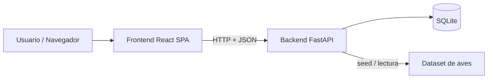
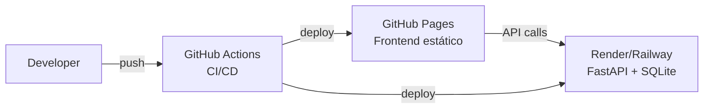

# Arquitectura de software — Top Trumps Aves de Colombia

## Visión de arquitectura
Aplicación web desacoplada en frontend y backend, con contrato OpenAPI como interfaz. Datos almacenados en SQLite (demo) y servidos por FastAPI. Frontend en React consume la API y maneja estados de UI.

## Componentes (C4 Container)

### Frontend (React + Vite + TypeScript)
- Responsabilidad: UI, flujo de juego, presentación de cartas, manejo de estados loading/empty/error.
- Consume API REST para iniciar partidas, obtener cartas y resolver rondas.
- En desarrollo usa MSW para simular el backend mientras se implementan los endpoints.

### Backend (FastAPI + Pydantic + Python)
- Responsabilidad: lógica de juego, reparto de cartas, comparación de atributos, resolución de rondas, persistencia temporal de partidas.
- Expone contrato OpenAPI auto-generado.
- SQLite para datos de aves y partidas (demo local).

### Datos
- SQLite con tablas: `aves`, `atributos`, `partidas`, `rondas`.
- Seed idempotente desde CSV/JSON de fuentes abiertas.

## Decisiones arquitectónicas
- **ADR-001**: selección de stack FastAPI + React SPA.

## Requisitos no funcionales (NFR)
- **Rendimiento**: tiempo de respuesta API < 200ms p95 para endpoints de juego.
- **Disponibilidad**: demo con SLO 95% uptime (sin acuerdo formal de SLA).
- **Escalabilidad**: soporta crecimiento esperado (2k usuarios/mes) sin cambios de arquitectura.
- **Seguridad**: sin PII; HTTPS obligatorio en producción; headers de seguridad.
- **Mantenibilidad**: cobertura de tests ≥70%; contrato OpenAPI validado.
- **Usabilidad**: responsive, estados loading/empty/error explícitos.

## Diagrama de despliegue (demo)

## Deuda técnica inicial
- Persistencia de partidas en SQLite: suficiente para demo, requiere migración a Postgres si se escala.
- Hot-seat sin autenticación: limitado a un dispositivo.
