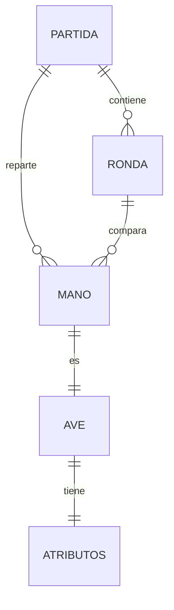

# Modelo de datos — Top Trumps Aves de Colombia

## Diagrama entidad-relación (DER)

## Entidades

### AVE
Representa una especie de ave con sus metadatos y atributos comparables.

| Campo | Tipo | Descripción |
|---|---|---|
| id | INTEGER PK | Identificador único |
| nombre_comun | TEXT | Nombre común en español |
| nombre_cientifico | TEXT | Nombre científico (latín) |
| familia | TEXT | Familia taxonómica |
| habitat | TEXT | Hábitat principal |
| dieta | TEXT | Tipo de alimentación |
| atribucion | TEXT | Fuente de los datos |
| imagen_url | TEXT | URL de imagen (opcional) |

### ATRIBUTOS
Atributos comparables de cada ave. Normalizado a una fila por ave para simplificar queries.

| Campo | Tipo | Descripción |
|---|---|---|
| ave_id | INTEGER PK/FK | Referencia a AVE |
| tamano_cm | REAL | Longitud corporal aproximada |
| peso_g | REAL | Peso aproximado |
| envergadura_cm | REAL | Envergadura de alas |
| velocidad_kmh | REAL | Velocidad de vuelo máxima estimada |
| esperanza_vida_anos | REAL | Esperanza de vida estimada |
| rareza | INTEGER | Índice 1-10 de dificultad de avistamiento |

### PARTIDA
Estado de una partida en curso o finalizada.

| Campo | Tipo | Descripción |
|---|---|---|
| id | TEXT PK | UUID de la partida |
| modo | TEXT | "ia" o "hotseat" |
| estado | TEXT | "activa" o "finalizada" |
| turno | TEXT | "jugador" u "oponente" |
| creada_en | DATETIME | Timestamp de creación |
| finalizada_en | DATETIME | Nullable |
| ganador | TEXT | Nullable; "jugador", "oponente" o "empate" |

### MANO
Asocia cartas con partidas y jugadores para representar el estado de la baraja.

| Campo | Tipo | Descripción |
|---|---|---|
| id | INTEGER PK | Identificador interno |
| partida_id | TEXT FK | Partida a la que pertenece |
| ave_id | INTEGER FK | Carta |
| jugador | TEXT | "jugador" u "oponente" |
| orden | INTEGER | Posición en la baraja del jugador |
| en_reserva | BOOLEAN | Indica si está en pila de empate |

### RONDA
Registro de cada ronda jugada.

| Campo | Tipo | Descripción |
|---|---|---|
| id | INTEGER PK | Identificador interno |
| partida_id | TEXT FK | Partida |
| atributo | TEXT | Atributo comparado |
| resultado | TEXT | "gana_jugador", "gana_oponente" o "empate" |
| carta_jugador_id | INTEGER FK | Carta jugada por jugador |
| carta_oponente_id | INTEGER FK | Carta jugada por oponente |
| reserva_acumulada | INTEGER | Número de cartas en reserva tras la ronda |
| jugada_en | DATETIME | Timestamp |

## Notas
- Sin PII: no se almacenan nombres de usuarios reales ni identificadores personales.
- Partidas son efímeras en demo; no hay historial persistente ni leaderboard.
- SQLite es suficiente para MVP; escalado futuro requeriría Postgres.
