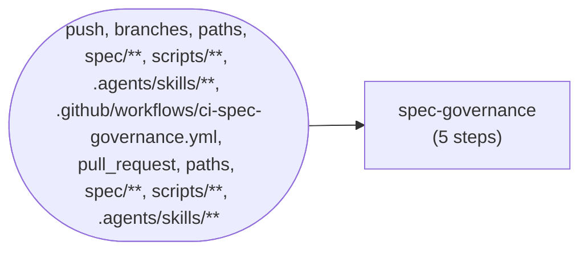
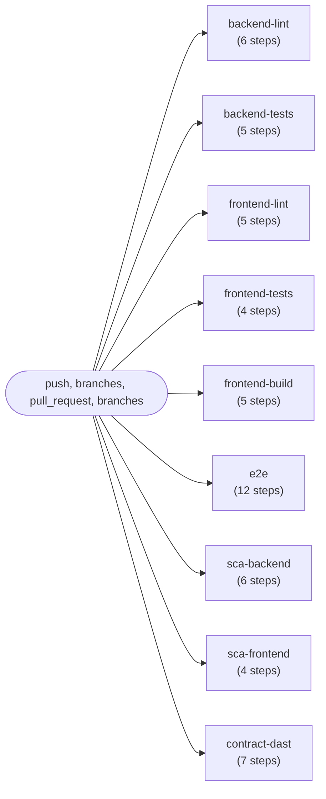

# Pipeline CI/CD (derivado de .github/workflows/)

> Generado por `pipeline_diagram.py`. NO editar a mano: regenerar
> desde los workflows y aprobar el cambio con recibo
> (`receipt.py emit --role devops-engineer`).

## Workflow: Spec Governance

Validación: OK — `needs:` íntegros, sin ciclos.

## Workflow: CI

| Severidad | Hallazgo |
|---|---|
| WARN | CI: job 'backend-lint' no tiene needs (corre en paralelo al inicio — ¿intencional?) |
| WARN | CI: job 'backend-tests' no tiene needs (corre en paralelo al inicio — ¿intencional?) |
| WARN | CI: job 'frontend-lint' no tiene needs (corre en paralelo al inicio — ¿intencional?) |
| WARN | CI: job 'frontend-tests' no tiene needs (corre en paralelo al inicio — ¿intencional?) |
| WARN | CI: job 'frontend-build' no tiene needs (corre en paralelo al inicio — ¿intencional?) |
| WARN | CI: job 'e2e' no tiene needs (corre en paralelo al inicio — ¿intencional?) |
| WARN | CI: job 'sca-backend' no tiene needs (corre en paralelo al inicio — ¿intencional?) |
| WARN | CI: job 'sca-frontend' no tiene needs (corre en paralelo al inicio — ¿intencional?) |
| WARN | CI: job 'contract-dast' no tiene needs (corre en paralelo al inicio — ¿intencional?) |

---
Workflows: 2 · Errores de integridad: 0
